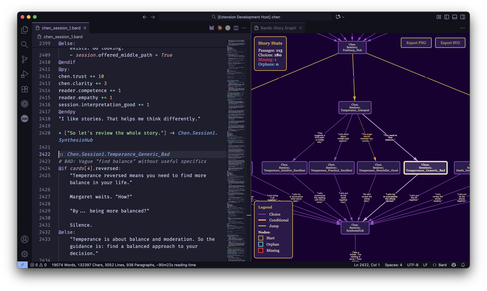
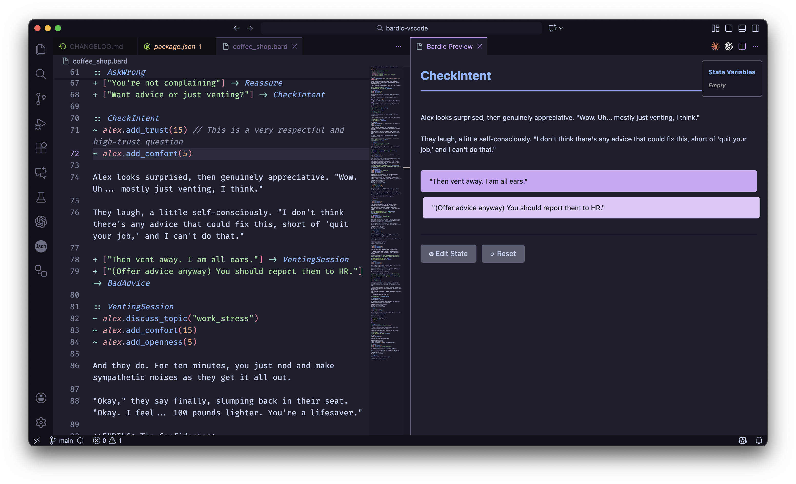

# Bardic

[](https://badge.fury.io/py/bardic)
[](https://pypi.org/project/bardic/)
[](https://marketplace.visualstudio.com/items?itemName=katelouie.bardic)
[](https://opensource.org/licenses/MIT)
[](https://deepwiki.com/katelouie/bardic)
[](https://github.com/katelouie/bardic/actions/workflows/test.yml)
<!-- [](https://codecov.io/gh/YOUR_USERNAME/bardic) -->

**Bardic is a Python-first interactive fiction engine that lets you import your own classes and use real Python in your stories.**

Write your branching narrative in a clean, simple syntax (inspired by Ink), and when you need complex logic, just use Python. Bardic is designed to be the "story layer" for games that need rich data models, complex state, and custom UIs. Bardic is frontend-agnostic and works with NiceGUI, Reflex, React+FastAPI, or any other frontend layer you want to build with. It compiles stories to JSON and is portable and versatile.

## Bardic in Action (with VSCode Extension)





## A Quick Example

Bardic syntax is designed to be simple and stay out of your way. Here's a small story that shows off the core features:

```bard
# Import your own Python classes, just like in a .py file
from my_game.character import Player

:: Start
# Create a new Player object
~ hero = Player("Hero")

Welcome to your adventure, {hero.name}!
You have {hero.health} health.

+ [Look around] -> Forest
+ [Check your bag] -> Inventory

:: Forest
The forest is dark and spooky.
~ hero.sprint() # Call a method on your object
You feel a bit tired.

+ [Go back] -> Start

:: Inventory
# Use Python blocks for complex logic
@py:
if not hero.inventory:
  bag_contents = "Your bag is empty."
else:
  # Use list comprehensions, f-strings...
  item_names = [item.name for item in hero.inventory]
  bag_contents = f"You have: {', '.join(item_names)}"
@endpy

{bag_contents}

+ [Go back] -> Start
```

## Why Bardic? A New Choice for Writers and Developers

You have great tools like Twine, Ink, and Ren'Py. So, why did I create Bardic?

Bardic is built for stories that get *complex*.

- **Twine** and **Ink** are both excellent authoring systems with large communities. If you like them, use them!
- **Bardic** is for when your "state" isn't just a number or a string, but a complex object. It's for when you want to write:
  - "I want this character to have an inventory, which is a **list of `Item` objects**."
  - "I need to **import my `Player` class** and call `player.take_damage(10)`."
  - "I want to simulate a full tarot deck, with 78 **`Card` objects**, each with its own properties and methods."

Have you ever been writing and thought, "I wish I could just `import` my custom class and use it"? **That's what Bardic does.**

It bridges the gap between simple, text-based branching logic and the full power of a programming language, letting you use both in the same file.

## Quick Start

**Install:**

```bash
pip install bardic

# With a UI framework (pick one):
pip install bardic[nicegui]    # Pure Python, single-file games
pip install bardic[web]        # FastAPI + React
pip install bardic[reflex]     # Python-to-React compilation
```

**Create a project and run it:**

```bash
bardic init my-game          # Creates a project from template
cd my-game
pip install -r requirements.txt
bardic compile example.bard -o compiled_stories/example.json
python player.py             # Opens at http://localhost:8080
```

Or skip the project template and just write a `.bard` file:

```bash
bardic play my_story.bard    # Auto-compiles and plays in terminal
```

### Installation Options

Bardic supports multiple UI frameworks. Choose the one you prefer:

| Framework | Install Command | Best For |
|-----------|----------------|----------|
| NiceGUI | `pip install bardic[nicegui]` | Pure Python, single-file games |
| FastAPI + React | `pip install bardic[web]` | Production web apps |
| Reflex | `pip install bardic[reflex]` | Python → React compilation |

Or install the core engine and add dependencies manually:

```bash
bardic init my-game
cd my-game
pip install -r requirements.txt
```

## Core Features

- **Write Python, Natively:** Use `~` for simple variable assignments or drop into full `@py:` blocks for complex logic.
- **Use Your Own Objects:** `import` your custom Python classes (like `Player`, `Card`, or `Client`) and use them directly in your story.
- **Passage Parameters:** Pass data between passages like function arguments: `:: Shop(item) -> BuyItem(item)`. Perfect for shops, NPC conversations, and dynamic content!
- **Complex State, Solved:** Bardic's engine can save and load your *entire game state*, including all your custom Python objects, right out of the box.
- **You Write the Story, Not the UI:** Bardic doesn't care if you use React, NiceGUI, or a terminal. It produces structured data for any UI.
  - Use the **NiceGUI** template for a pure-Python, single-file game.
  - Use the **Web** template (FastAPI + React) for a production-ready, highly custom web game.
- **Clean, Writer-First Syntax:** Focus on your story with a minimal, line-based syntax for passages (`::`), choices (`+`), and text.
- **Visualize Your Story:** Automatically generate a flowchart of your entire story to find highlighted dead ends or orphaned passages with the `bardic graph` command.
- **Instant Start-Up:** Get a working game in 60 seconds with `bardic init`. It comes with a browser-based frontend pre-configured and ready to run with a single command. (NiceGUI, Reflex, or React -- take your pick.)
- **Browser distribution.** `bardic bundle` packages your game for itch.io with a full Python runtime (Pyodide). No server required.
- **VS Code Integration:** Syntax highlighting, snippets, code folding, live preview, and graph-based navigation. Install "Bardic" from the marketplace or run `code --install-extension katelouie.bardic`.

## CLI Reference

| Command | Description |
| ------- | ----------- |
| `bardic init my-game` | Create a new project from template (nicegui, web, or reflex) |
| `bardic compile story.bard` | Compile `.bard` source to `.json` |
| `bardic play story.bard` | Play a story in the terminal (accepts `.bard` or `.json`) |
| `bardic graph story.json` | Generate a visual flowchart (`.png`, `.svg`, or `.pdf`) |
| `bardic bundle story.bard` | Package for browser distribution (itch.io, static hosting) |
| `bardic serve` | Start the web runtime (FastAPI backend + React frontend) |

## Syntax At a Glance

| Syntax | Meaning |
| ------ | ------- |
| `:: Name` | Passage header |
| `+ [Text] -> Target` | Choice (persistent) |
| `* [Text] -> Target` | Choice (one-time, disappears after use) |
| `~ variable = value` | Variable assignment |
| `{variable}` | Display a variable or expression |
| `@if condition:` ... `@endif` | Conditional block |
| `@for item in list:` ... `@endfor` | Loop |
| `@py:` ... `@endpy` | Python code block |
| `@include file.bard` | Include another file |
| `@render component(data)` | Send data to a UI component |
| `@input name="x" label="Y"` | Request player input |

## Browser Distribution (itch.io)

Want to share your game on itch.io or any web hosting? Bardic can bundle your entire game into a self-contained package that runs in the browser:

```bash
# Create a browser-ready bundle
bardic bundle my-story.bard --zip

# With options
bardic bundle my-story.bard -o ./release -n "My Epic Adventure" --theme dark --zip
```

This creates a ZIP file containing:

- Your compiled story
- The Bardic engine (browser version)
- A complete Python runtime (Pyodide)
- Pre-installed packages: numpy, pillow, networkx, pyyaml, regex, jinja2, nltk, and more

**Bundle sizes:**

- Full bundle: ~17 MB (all packages included)
- Minimal bundle: ~5 MB (use `--minimal` flag for stories that don't need extra packages)

**No server required** - everything runs in the browser via WebAssembly.

### Options

| Option | Description |
| ------- | ------------ |
| `-o, --output` | Output directory (default: `./dist`) |
| `-n, --name` | Game title (uses story metadata if not specified) |
| `-t, --theme` | Visual theme: `dark`, `light`, or `retro` |
| `-z, --zip` | Create a ZIP file ready for upload |
| `-m, --minimal` | Smaller bundle (~5 MB) with only core Pyodide |

### Uploading to itch.io

1. Run `bardic bundle my-story.bard --zip`
2. Go to [itch.io](https://itch.io) and create a new project
3. Upload the generated ZIP file
4. Check "This file will be played in the browser"
5. Publish!

### Testing Locally

```bash
bardic bundle my-story.bard -o ./dist
cd dist
python -m http.server 8000
# Open http://localhost:8000 in your browser
```

## Example Game: *Arcanum*

Need to see a large-scale project? The [Arcanum](https://github.com/katelouie/arcanum-game) cozy tarot reading game is built with Bardic. It's an example of using Bardic with custom Python classes, complex state, and a NiceGUI frontend.

## Editor Support

**VSCode Extension:**

Get syntax highlighting, code snippets, code folding, graph node navigation and debugging, and live preview from any point in the story with variable injection:

1. Open VSCode
2. Search "Bardic" in Extensions
3. Install

Or install from command line:

```bash
code --install-extension katelouie.bardic
```

[View on VSCode Marketplace](https://marketplace.visualstudio.com/items?itemName=katelouie.bardic)

## Where to Go Next?

- **New to Bardic?** I've put together a short [tutorial course](docs/tutorials/README.md) that walks you through all of the syntax and features of Bardic, from beginner to advanced.
- **Want to see all the syntax?** Check out the [Language Specification](https://github.com/katelouie/bardic/blob/main/docs/spec.md) for the full list of features, from loops to render directives.
- **Want to build the engine?** See our [`CONTRIBUTING.md`](CONTRIBUTING.md) for details on the architecture and development setup.
- **Want VS Code integration?** Download the [Bardic VS Code extension](https://github.com/katelouie/bardic-vscode) with full syntax highlighting, snippets and code folding. Also has live passage preview and graph-based navigation of your source file.
- See the [DeepWiki detailed documentation](https://deepwiki.com/katelouie/bardic) generated from AI code indexing. It includes a *lot* of technical implementation details.
